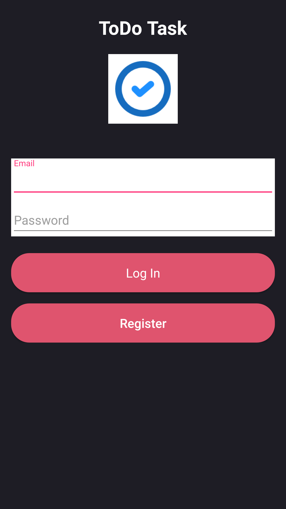
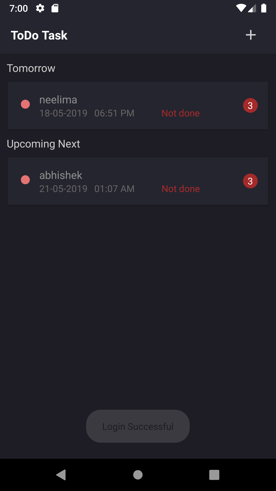
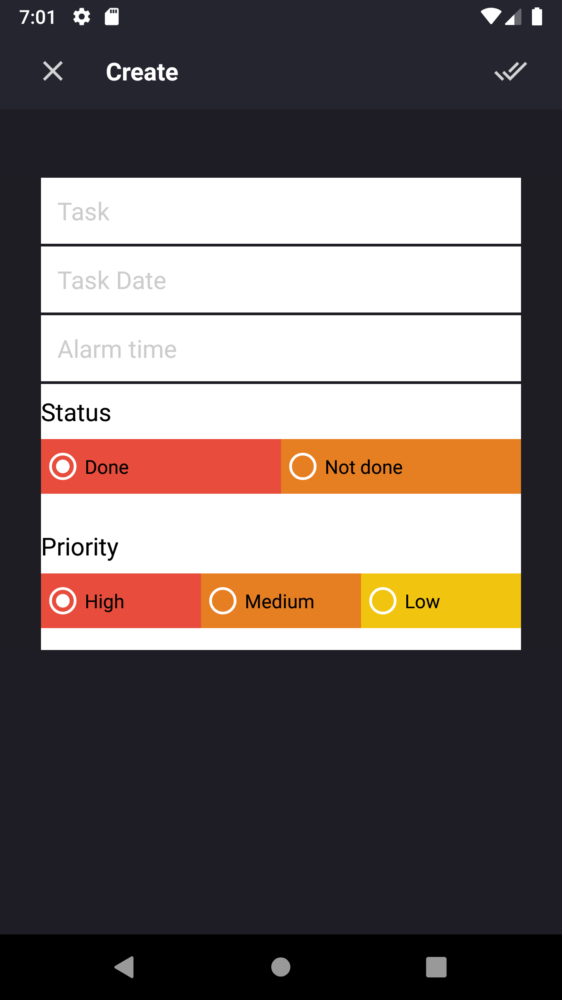
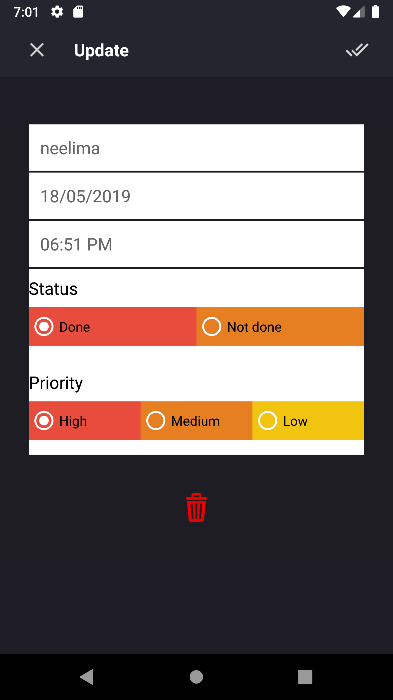

# ToDo-App-Android

This is a ToDo List App developed using Android Studio. ToDoList is software in the category of Task Management, Project Management, Productivity, “Getting Things Done” (GTD), Scheduling, and Collaboration. This ToDo App help us keep track of daily obligations.

## Images of Todo App

</img>
</img>
</img>
</img>

## Features

<ul>
<li>Login</li>
<li>Register</li>
<li>Crud Function</li>
<li>Schedule Separation</li>
</ul>

## Framework
  MVVM is one of the architectural patterns which enhances separation of concerns, it allows separating the user interface logic from the business (or the back-end) logic. Its target (with other MVC patterns goal) is to achieve the following principle “Keeping UI code simple and free of app logic in order to make it easier to manage”.
  
 
## Database

<ul>
<li>SQL-lite Database</li>
</ul>
 
## Android Component 

<ul>
<li>Fragement</li>
<li>Activity</li>
<li>Date / Time Picker</li>
<li>Recycle View</li>
</ul>

 ## License
 
 Copyright 2019 Abinash K.C. The British College 
 

